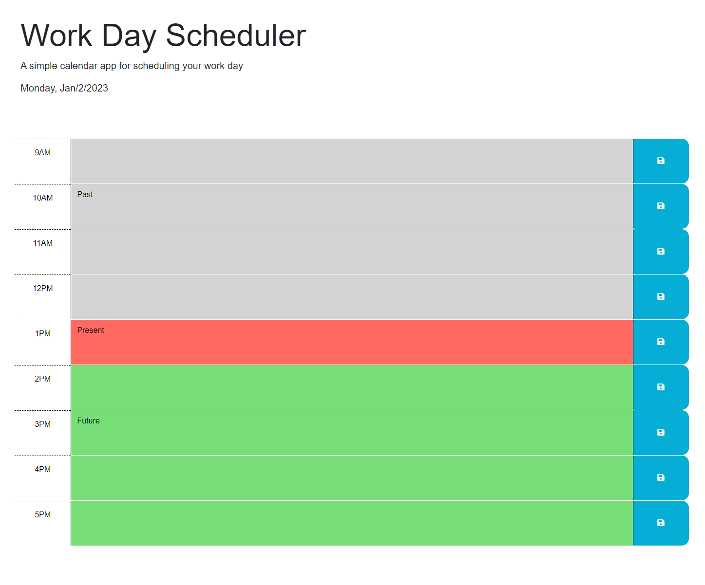

# Work_Day_Scheduler

## Description

This Work Day Scheduler would allow a user to add important events to a daily planner so that their time can be managed effectively. This application accomplishes this by allowing the user to input plans into textboxes and save them to local storage. The styling on the planner also changes depending on the time of day so that the user knows when it is time for each planned event. This project mad me more familiar with JQuery and its documentation.

## Installation

N/A

## Usage

Visit the website at https://jullian0426.github.io/Work_Day_Scheduler/  
Input your daily plans into the textboxes and click the respective save button.

## Credits

N/A

## License

N/A